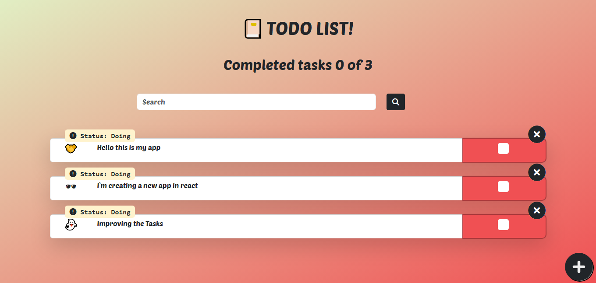
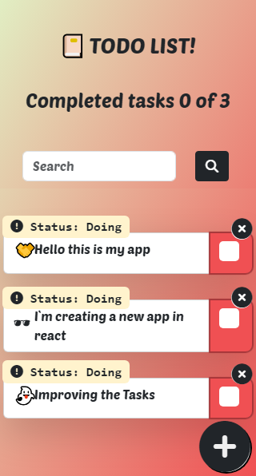

# TODO Application 

A user-friendly todo application built with React and Bootstrap for a smooth and responsive experience. This app allows you to manage your tasks effectively, leveraging local storage to persist your data even after you refresh the page.
## UI Desktop

## UI Mobile

## Technologies
* **React:** A JavaScript library for building dynamic user interfaces with a declarative approach, ensuring efficient component-based development.
* **Bootstrap:** A popular CSS framework providing pre-built components and utility classes, enabling rapid and responsive web design.
* **Font Awesome:** A comprehensive icon library offering a vast collection of scalable vector icons to enhance the visual appeal and clarity of your application.
* **Sass (SCSS):** A preprocessor for CSS that extends its functionality with features like variables, mixins, and nesting, leading to cleaner, more maintainable styles

## Available Scripts
### Start the Development Server:
Run the following command to start the development server:

`npm start`

This will typically launch your application in a browser window at http://localhost:3000 (the default port for React development servers). You can then make changes to your code and see them reflected in the browser immediately without having to manually rebuild the project.
Building for Production:

### Create a Production Build:
Run the following command to create an optimized production build of your application:

`npm run build`

This will create a new folder named build in your project directory containing the production-ready files.